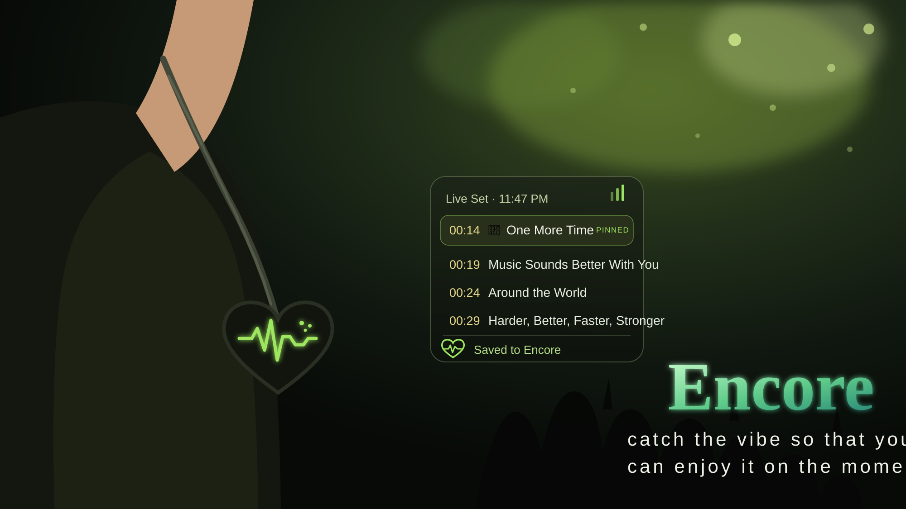
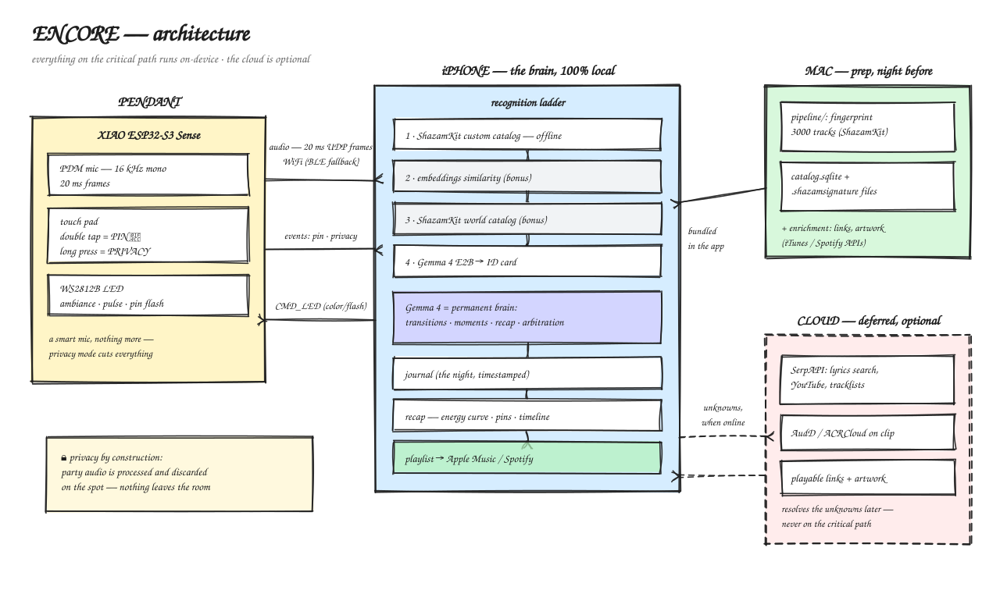

<p align="center">
  
</p>

# Encore

**Catch the vibe so that you can enjoy it on the moment.**

Encore is an intelligent pendant that captures every track, transition, and emotion of a DJ set — in real time and **entirely on-device** — so you can stay present and enjoy the party without reaching for your phone. Afterwards, Encore turns your night into a timestamped setlist, your pinned moments, and a ready-to-play playlist.

Built in **1 day** at the **Gemma 4 Hackathon Paris (2026-07-25)** — Edge/On-Device track.
Team: **Jade** (iOS + firmware), **Mathieu** (pipeline + data).

---

## 1. The problem

**Music is supposed to make you forget time, space, and your phone.**

But apps like Shazam have taught us to do the opposite. The moment you hear a track you love, you reach into your pocket, unlock your phone, open the app, and point it toward the room.

***The moment is gone.***

Sometimes you are not quick enough to catch the track. The fear of missing it pulls you away from the music, the people around you, and the experience itself. Instead of living the night, you are looking at a screen.

**And even worse, Shazam does not always find the song.** DJ transitions, edits, pitched tracks, bootlegs, rarities, and unreleased music are often the sounds that define an unforgettable night — and they are exactly the sounds traditional recognition struggles to identify.

Even when it works, all you receive is a flat list of song titles.

**You found the track, but you lost the momentum, the vibe, the people around you...**

## 2. The solution

**Encore is an intelligent pendant that captures your entire DJ set while you fully live the party.**

The pendant listens discreetly while your phone identifies, understands, and organizes the music in real time. No need to unlock a screen, open an app, or interrupt the moment.

**No screens. No interruptions. No cloud.**

At the heart of Encore is **Gemma, a powerful local AI model running directly on your phone**. It understands context, connects moments, organizes tracks, detects highlights, and transforms raw music recognition into a meaningful memory of your night.

When a track means something, there is only one gesture:

***Tap the pendant.***

Encore instantly pins the moment, so you can return to it later without leaving the dance floor.

Later, Encore lets you live the night *one more time*: a timestamped setlist, the transitions between tracks, your highlighted moments, and a complete playlist ready for Apple Music or Spotify.

Positioning: **Shazam identifies songs. Encore captures the emotion of the party — so you can live it encore and encore.**

## 3. Architecture



**The recognition ladder** (most precise → most robust): local fingerprint (ShazamKit custom catalog, 100% offline, 3–5 s) → embeddings similarity → Shazam world catalog (if online) → **Gemma ID card** (the model listens and describes what nothing else recognizes). Nothing is ever lost: every unknown keeps its clip, fingerprint, embedding and ID card for deferred resolution when network returns.

**Everything on the critical path runs on the edge**: capture on the pendant; fingerprint, embeddings, Gemma inference, timeline and recap on the iPhone. No server of ours. The cloud (SerpAPI, links, playlist) is deferred, optional enrichment only.

## 4. Why fully local

- **Privacy by construction.** The pendant hears an entire night of a party — conversations included. Party audio is processed and discarded on the spot; nothing ever leaves the phone. That is only acceptable if *nothing* is streamed to a server.
- **It works where the music actually is.** Clubs, basements, festivals: no signal, saturated networks, airplane mode. Encore's whole recognition and understanding path works with zero connectivity. **The cloud improves Encore, but Encore doesn't need the cloud.**

## 5. How: recognition + Gemma

- **Music recognition** uses **ShazamKit with a custom on-device catalog** — the iOS equivalent of Google's music recognition stack. It is one interchangeable rung of the ladder: a Google/Android recognition backend can be integrated later without changing anything else.
- **Gemma is the brain, and it's multimodal.** Gemma (like Gemini) accepts **audio natively as input** — which is exactly what this project needs. When fingerprinting fails (bootlegs, transitions, unreleased tracks), Gemma *listens* to the clip and produces a structured ID card (genre, era, mood, BPM/key injected by DSP). It also qualifies transitions, tags highlight moments, arbitrates deferred-resolution candidates, and writes the end-of-night recap.
- **Small enough for the edge.** Gemma 4 E2B runs on-device, kept sharp by a two-stage context compiler that compresses the party state and any retrieved evidence into a minimal token budget.

## 6. Where we are — honest status

One hackathon day is short. We prioritized proving each link of the chain, in order:

| Step | Status |
|---|---|
| Pendant → iPhone audio streaming (ESP32-S3, UDP) | ✅ working |
| On-device recognition (ShazamKit custom catalog, offline) | ✅ working |
| Gemma via API — audio in, ID card out | ✅ tested, works well |
| Gemma running **locally on the Mac** (same pipeline in Python) | ✅ working |
| Gemma **inside the iOS app** | 🔜 ~2–4 h of work remaining |

Embedding Gemma in the mobile app is the last mile; it didn't fit in the single hackathon day. **We are implementing it this weekend and will update this repo.** The Mac pipeline (`pipeline/`) runs the exact same logic today and serves as the reference implementation.

## 7. Repository map

Every module has its own README with how it works and its current status:

| Folder | What it is | README |
|---|---|---|
| `contracts/` | **Source of truth**: pendant↔phone protocol + JSON schemas binding all three codebases | [contracts/README.md](contracts/README.md) |
| `firmware/` | XIAO ESP32-S3 pendant: PDM capture → UDP streaming, touch, LED (PlatformIO, C++) | [firmware/README.md](firmware/README.md) |
| `ios/` | The brain: Swift app — receiver, recognition ladder, Gemma, journal, recap, playlist | [ios/README.md](ios/README.md) |
| `pipeline/` | Python (Mac): catalog fingerprint + enrichment, context compiler, SerpAPI resolver, benchmark | [pipeline/README.md](pipeline/README.md) |
| `data/` | Catalog + demo set + golden clips (payloads gitignored; manifests committed) | [data/README.md](data/README.md) |
| `demo/` | 5-minute demo script, test plan, backup HTML dashboard | [demo/README.md](demo/README.md) |
| `hardware/` | 3D-printed case generator + STLs, wiring guide | [hardware/README.md](hardware/README.md) |
| `docs/` | The full PRD ([PROPOSAL.md](docs/PROPOSAL.md)) — product reference | — |

## 8. Quick commands

```bash
# Pipeline setup
cd pipeline && pip install -r requirements.txt

# Catalog fingerprint (on the Mac)
python pipeline/ingest/fingerprint_catalog.py --music-dir <dir>

# Pipeline tests
cd pipeline && pytest

# Firmware build + flash (XIAO plugged in)
cd firmware && pio run -t upload
```

Secrets live in `.env` (gitignored) — names listed in `.env.example`. Full repo rules: [`CLAUDE.md`](CLAUDE.md).
